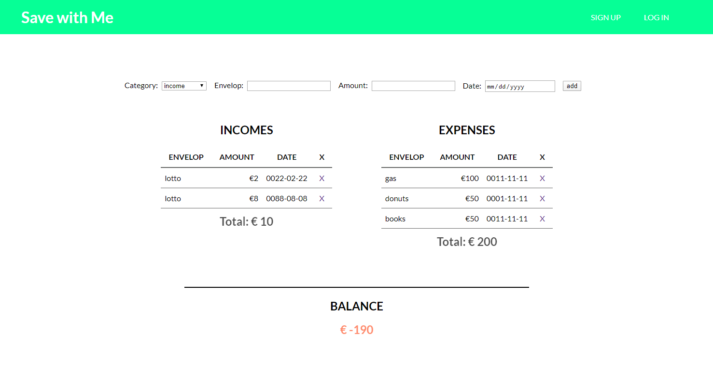
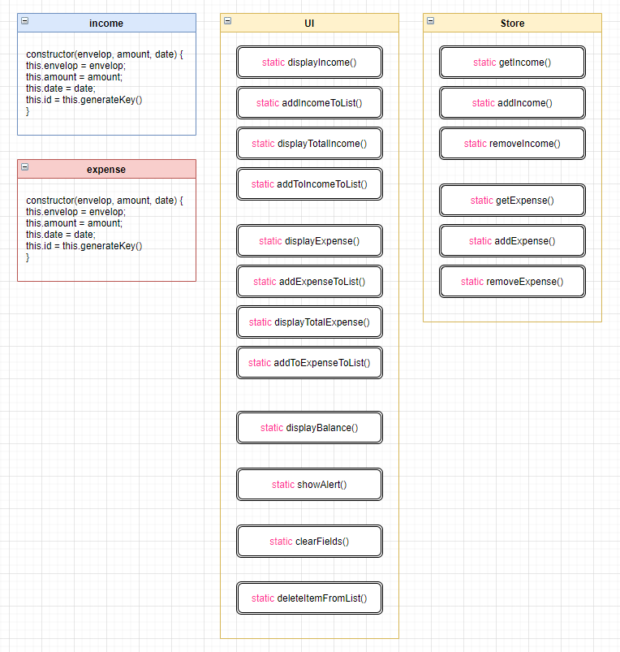
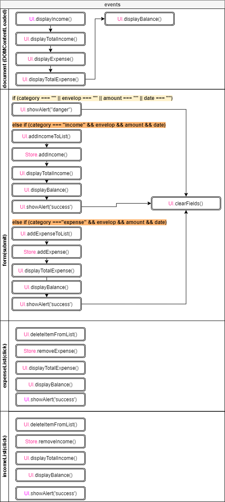

# Save with Me

Save with Me is a personal accounting app to track incomes and expenses.

Click [here](https://chaeahpark.github.io/account-app/) to try out.

## 1. Development

This project has been developed mainly with JavaScript. The following topics were considered during the development process.

- To use the `localStorage` to save and to remove data of incomes and expenses.
- To use `class` in order to instantiate incomes and expenses as well as to encapsulate functions into categories relevant with their core roles.

### 1.1. `localStorage`

Lets talk about the first topic, the `localStorage`. All information of the accounting app should be remembered between sessions in order to keep tracking incomes and expenses of a user. The `localStorage` object is used to store data in a way that remains even after page reloads.

### 1.2. `class`

I primarily use `class` to define the shape of income and expense objects - which methods and properties they have. Because they are contantly created after a user fill out the form and hit the add button.

In addition, `class` has been used to categorize functions (encapsulation) and to enhance readability. As you can see from the diagram there are UI and Store classes and each class contains functions related with its class name. For instance, UI class has methods dealing with UI on the browser. Whereas the Store class includes methods working with `localStorage`. Those methods are `static` so that they are not included in an instance of the classes.

##2. Code structure

### 2.1. classes

### 2.2 events

##3. Materials

- [Eloquent JavaScript](https://amzn.to/38mKvdl)
- [HTML&CSS](https://amzn.to/2UHC6gN)
